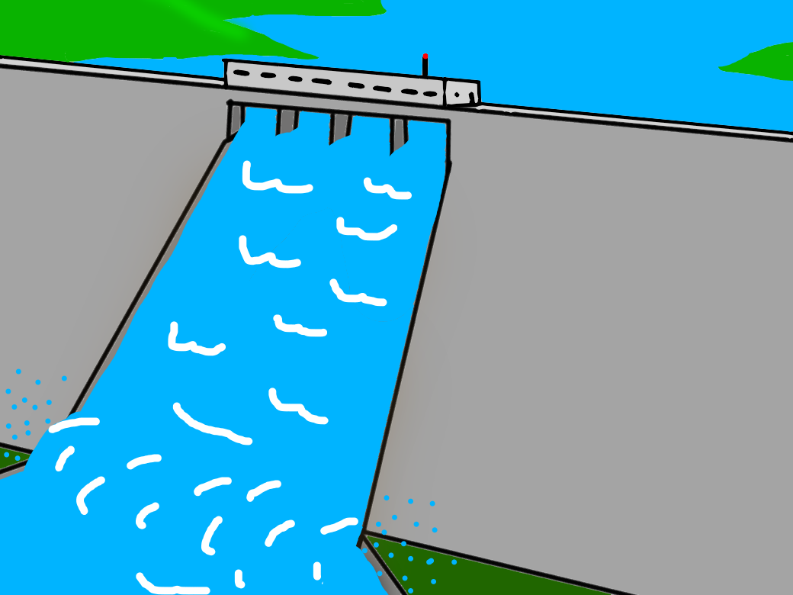
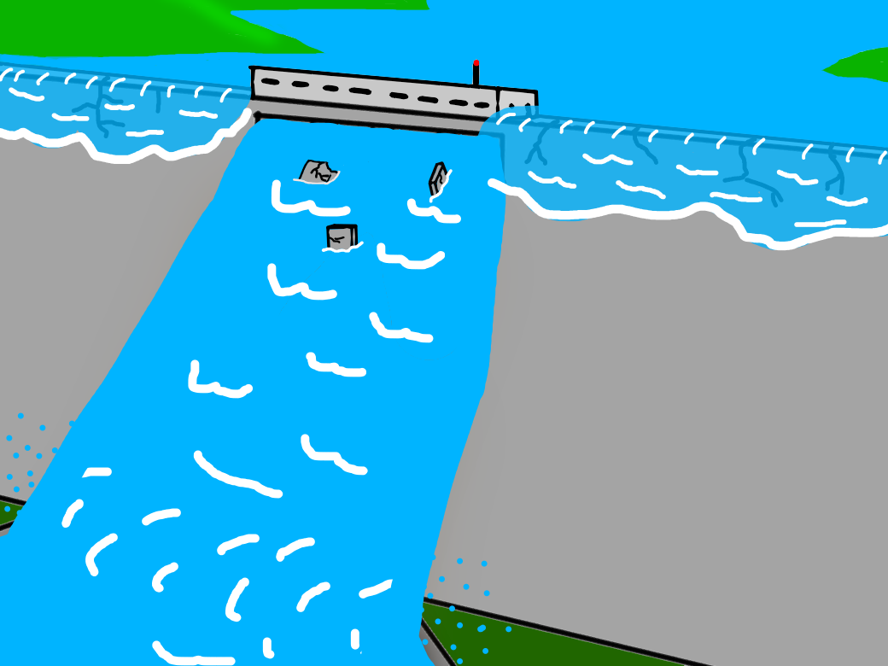
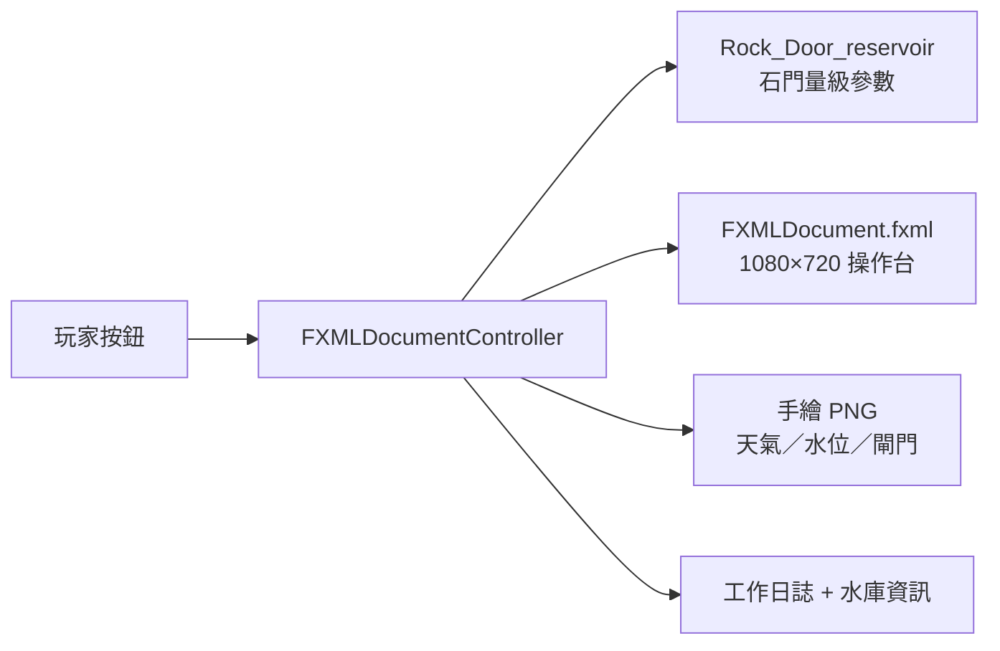

<p align="center">
  <a href="#readme"></a>
  <a href="docs/README.en.md"></a>
</p>

<p align="center">
  
</p>

<h1 align="center">Reservoir Management Simulation</h1>

<p align="center">
  <strong>水庫模擬器 Beta</strong><br>
  過一天，看天氣，決定供水、發電、閘門與警報。<br>
  2023 高科大資管 JavaFX 視窗小專案，不是營運系統。
</p>

<p align="center">
  
  
  
  
  
  
</p>

<p align="center">
  <a href="#功能">功能</a> ·
  <a href="#示範">示範</a> ·
  <a href="#架構">架構</a> ·
  <a href="#安裝">安裝</a> ·
  <a href="#專案結構">結構</a> ·
  <a href="#貢獻">貢獻</a> ·
  <a href="docs/README.md">文件索引</a> ·
  <a href="CHANGELOG.md">變更紀錄</a>
</p>

---

水位太高會潰堤，太低就沒水、沒電。這個作業把玩家放進控制室：每天抽一種天氣，進水量跟著變；你按閘門、供水、發電、洩洪警報撐下去。撐不住的理由寫在工作日誌裡——連續停水、停電、民怨，或水真的漫過壩。

數值範圍對過 **石門水庫** 公開資料的量級，收在 `Rock_Door_reservoir`（Rock Door = 石門）。報告原文寫：以後若蒐到別座水庫的數字，可以再加一個類別。

> **現況。** 這是 2023 年繳交的 JavaFX 小遊戲，2026 年才收成可公開的展示倉。程式停在當年行為；拼字、未使用的 `evaporation()`、NetBeans 範本註解都還在。學號報告、建置產物與用不到的 GIF 留在本機 `local/`，已被 git 忽略。

## 功能

<table>
<tr>
<td width="33%" valign="top">

### 一天一步

「度過一天」結算進水、供水、發電、洩洪。「度過一月」連跑 30 天。天氣晴／陰／雨，進水區間不同；每 30 天可造一次人工雨，強迫次日下雨。

</td>
<td width="33%" valign="top">

### 控制室取捨

供水、發電、閘門（關／半開／全開）、洩洪警報各自獨立。水位不夠仍硬發電或硬供水，日誌會記失敗。洩洪不發警報、或沒洩洪卻發警報，都算民怨。

</td>
<td width="33%" valign="top">

### 畫面跟著狀態走

天空、庫區、閘門監視器、操作台警示燈會換圖。滿水、中水位、乾涸、全排／半排／未排、潰堤各有一張手繪圖。

</td>
</tr>
</table>

| 還有這些 | 為什麼這樣做 |
| --- | --- |
| **失敗就是調職** | 連續停水 3 天、停電 7 天、蓄水超過上限、民怨滿 3 次。沒有分數榜，只問你能撐幾天。 |
| **參數集中在一個類** | 進水、用水、發電、洩洪量都從 `Rock_Door_reservoir` 讀。課程目標是「別把魔術數字散在 controller」。 |
| **手繪、不借官方圖** | 操作台與壩景是自己畫的。公開樹不放台灣水利單位的 logo 或照片。 |
| **課堂垃圾不進 git** | 報告檔名帶學號；`build/`、`dist/`、`nbproject/private/`、四份 `jfx-impl` 備份、未引用 GIF 全部忽略。 |

規則、區間與失敗條件見 [`docs/gameplay.md`](docs/gameplay.md)。

## 示範

下列是當年進遊戲的手繪素材，不是 2026 重跑截圖。要看完整操作台，請在 JDK 8 ＋ JavaFX 裡開專案。

<p align="center">
  
</p>
<p align="center"><sub>控制室底板。工作日誌、水庫資訊、閘門與按鈕疊在這張圖上。</sub></p>

<p align="center">
  
  &nbsp;
  
</p>
<p align="center"><sub>左：滿庫背景。右：閘門全開時的監視器畫面。</sub></p>

<p align="center">
  
</p>
<p align="center"><sub>潰堤。蓄水量超過上限時，監視器換成這張。</sub></p>

### 一條完整路徑

```text
啟動 → 隨機最高蓄水量與初始水位
        ↓
看「今日天氣／預計進水／警報」
        ↓
供水？發電？閘門關／半開／全開？要不要發洩洪警報？
        ↓
度過一天（或連跑一個月）
        ↓
日誌結算；背景與監視器換圖
        ↓
過關進下一天　或　「你被調職了」→ 再試一次
```

人工雨冷卻、水位分級與民怨規則寫在 [`docs/gameplay.md`](docs/gameplay.md)。

## 架構



沒有伺服器、沒有資料庫、沒有存檔。一天就是一次 `one_day()`。

| 層 | 位置 | 責任 |
| --- | --- | --- |
| 進入點 | `Reservoir_Management_Simulation.java` | 載入 FXML，標題「水庫模擬器Beta」 |
| 規則 | `FXMLDocumentController.java` | 結算一天、失敗、換圖、人工雨 |
| 參數 | `Rock_Door_reservoir.java` | 進水／用水／發電／洩洪區間 |
| 畫面 | `FXMLDocument.fxml` | 錨點排版、單選與按鈕 |
| 素材 | `src/.../*.png` | 天空、庫區、操作台、監視器 |
| 說明 | `docs/` | 規則、安裝、英文對照 |

<details>
<summary><strong>技術細節（可折疊）</strong></summary>

<br>

- 目標：**Java 8 ＋ 內建 JavaFX**。當年用 NetBeans 8.2rc 開 Ant JavaFX 專案。JDK 11 以後 JavaFX 不在 JDK 裡，見 [`docs/installation.md`](docs/installation.md)。
- 視窗 1080×720。`application.vendor` 與 `@author` 仍是 NetBeans 預設的 `admin`，沒改。
- 天氣三態進水（萬立方公尺，再加亂數）：晴 `70+rnd(70)`、陰 `200+rnd(100)`、雨 `600+rnd(900)`。全開洩洪 1500、半開 750。用水與發電各 `150+rnd(100)`。
- 最高蓄水量 `20000+rnd(2000)`。初始水位 `1000+rnd(max基準-2000)`。
- 水位分級：`> 2/3` 滿、`> 1/3` 中、其餘缺水。潰堤／乾涸警報用 `max/15` 與 `14/15`。
- `evaporation()` 回傳 10，**從未呼叫**。`ImpureDimwittedCottonmouth-max-1mb.gif` 同樣沒被程式讀到，已移出 `src/`。
- 展示倉相對 2023 檔：**沒改遊戲邏輯**。只整理樹、忽略建置垃圾與個資、補文件。
- WebStart／瀏覽器執行設定還在 `nbproject/configs/`。那條部署路徑 2026 年已經不可用，不要當成安裝方式。

</details>

## 安裝

需要 **JDK 8（含 JavaFX）** 與能開 Ant JavaFX 專案的 **NetBeans 8.2**（或同等舊版）。這不是 `javac` 一行就能在 JDK 21 跑起來的專案。

### 1. 用 NetBeans 開

1. 安裝 Oracle JDK 8（或 Liberica Full JDK 8 這類仍帶 JavaFX 的發行）。
2. 安裝 NetBeans 8.2，*File → Open Project*，選本目錄。
3. 確認專案屬性裡的 Java 平台是 JDK 8。
4. Run。視窗標題應為「水庫模擬器Beta」。

### 2. 本機才保留的東西

`local/` 有 2023 報告與未使用 GIF，**不要**推進公開分支。細節在 [`docs/installation.md`](docs/installation.md) 與 [`local/README.md`](local/README.md)。

## 專案結構

```text
src/reservoir_management_simulation/
                       Java、FXML、手繪 PNG
nbproject/             NetBeans 專案（private／備份已忽略）
build.xml              Ant 進入點
docs/                  說明、Hero、示範圖；英文在 README.en.md
LICENSE                MIT
CONTRIBUTING.md        貢獻約定
CHANGELOG.md           Keep a Changelog 2.0.0
local/                 學號報告與未使用 GIF（gitignore）
```

完整樹狀與「為什麼那些檔不進倉」見 [`docs/README.md`](docs/README.md)。

## 貢獻

這是封存的課程作業。歡迎修正文件、補 2026 年還能開專案的環境註記；請不要把 `local/`、`build/`、`dist/` 或學號推進公開分支。細節在 [`CONTRIBUTING.md`](CONTRIBUTING.md)。

## 授權

程式、手繪圖與文件：[MIT](LICENSE) © 2023 張任沂；2026 年收成展示倉。

石門水庫的公開統計只當參數量級參考，資料仍屬原公布機關。Oracle JDK、JavaFX、NetBeans **不是**本授權範圍。

---

<p align="center">
  <sub>國立高雄科技大學 資訊管理系 · JavaFX 視窗小專案 · 2023</sub>
</p>
