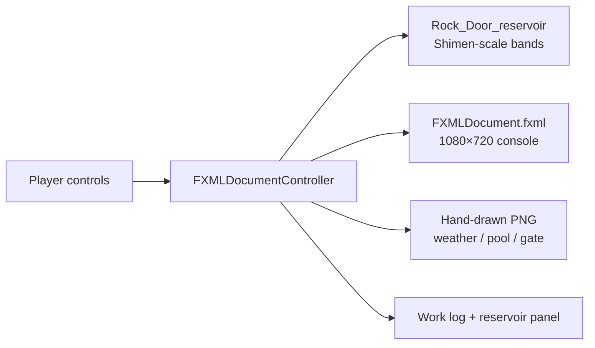

<p align="center">
  <a href="../README.md"></a>
  <a href="#readme"></a>
</p>

<p align="center">
  
</p>

<h1 align="center">Reservoir Management Simulation</h1>

<p align="center">
  <strong>Reservoir Simulator Beta</strong><br>
  Spend a day, read the weather, then choose supply, generation, gates and alarms.<br>
  A 2023 NKUST IM JavaFX window assignment — not an operations desk.
</p>

<p align="center">
  
  
  
  
  
  
</p>

<p align="center">
  <a href="#features">Features</a> ·
  <a href="#demo">Demo</a> ·
  <a href="#architecture">Architecture</a> ·
  <a href="#installation">Installation</a> ·
  <a href="#project-structure">Structure</a> ·
  <a href="#contributing">Contributing</a> ·
  <a href="./README.md">Docs index</a> ·
  <a href="../CHANGELOG.md">Changelog</a>
</p>

---

Too much water breaches the dam; too little leaves the town without tap water or power. The assignment puts you in the control room: each day draws a weather state and an inflow band; you set the gates, supply, generation and flood alarm. Failures are written into the work log — consecutive outages, public complaints, or water over the crest.

The numeric bands were sized against **Shimen Reservoir** public figures and live in `Rock_Door_reservoir` (Rock Door = 石門). The 2023 report said another reservoir class could be added later if more numbers were collected.

English in this repository is **English**.

> **Status.** Submitted as a JavaFX mini-game in 2023; packaged for GitHub in 2026. Behaviour is frozen. Typos, the unused `evaporation()` helper and the NetBeans licence-header comments remain. The marked report, build products and unused GIF stay in local `local/` and are gitignored.

## Features

<table>
<tr>
<td width="33%" valign="top">

### One day, one step

“Spend a day” settles inflow, supply, generation and release. “Spend a month” runs that loop 30 times. Weather is sun / cloud / rain, each with its own inflow band. Every 30 days you may make artificial rain and force the next day wet.

</td>
<td width="33%" valign="top">

### Control-room trade-offs

Supply, generation, the gate (shut / half / open) and the flood alarm are independent. Trying to generate or supply on a low pool is logged as a failure. Releasing without an alarm, or alarming with the gate shut, counts as a complaint.

</td>
<td width="33%" valign="top">

### Art follows state

Sky, pool, gate monitor and console warning lamp swap drawings. Full, mid, dry, full-release, half-release, closed and breach each have a hand-drawn plate.

</td>
</tr>
</table>

| Also | Why |
| --- | --- |
| **Failure is a transfer** | Three days without water, seven without power, storage above the crest, or three complaints. There is no scoreboard — only how many days you lasted. |
| **One parameter class** | Inflow, demand, generation and release are read from `Rock_Door_reservoir`. The course point was “do not scatter magic numbers in the controller”. |
| **Drawn, not borrowed** | Console and dam views are original. The public tree does not carry official water-agency marks or photographs. |
| **Course clutter stays off git** | The report filename holds a student number. `build/`, `dist/`, `nbproject/private/`, four `jfx-impl` backups and the unreferenced GIF are ignored. |

Rules, bands and fail states: [`gameplay.md`](gameplay.md) (Traditional Chinese).

## Demo

These are the 2023 in-game drawings, not a 2026 re-run. For the assembled console, open the project on JDK 8 with JavaFX.

<p align="center">
  
</p>
<p align="center"><sub>Control-room plate. The work log, reservoir panel, gates and buttons sit on top of this drawing.</sub></p>

<p align="center">
  
  &nbsp;
  
</p>
<p align="center"><sub>Left: full-pool backdrop. Right: monitor plate when the gate is fully open.</sub></p>

<p align="center">
  
</p>
<p align="center"><sub>Breach. The monitor switches to this plate when storage exceeds the maximum.</sub></p>

### One full path

```text
Launch → random crest and starting pool
        ↓
Read today’s weather / expected inflow / alarm
        ↓
Supply? Generate? Gate shut / half / open? Sound the flood alarm?
        ↓
Spend a day (or a thirty-day burst)
        ↓
Log settles; backdrop and monitor swap
        ↓
Next day  or  “you have been transferred” → try again
```

Rain cooldown, pool bands and complaint rules: [`gameplay.md`](gameplay.md).

## Architecture



No server, no database, no save file. A day is one `one_day()` call.

| Layer | Path | Job |
| --- | --- | --- |
| Entry | `Reservoir_Management_Simulation.java` | Load FXML; title 「水庫模擬器Beta」 |
| Rules | `FXMLDocumentController.java` | Settle a day, fail, swap art, artificial rain |
| Parameters | `Rock_Door_reservoir.java` | Inflow / demand / generation / release bands |
| Layout | `FXMLDocument.fxml` | Anchored controls |
| Art | `src/.../*.png` | Sky, pool, console, monitor |
| Docs | `docs/` | Rules, install, this tour |

<details>
<summary><strong>Technical notes (collapsed)</strong></summary>

<br>

- Target: **Java 8 with bundled JavaFX**. Opened in 2023 as a NetBeans 8.2rc Ant JavaFX project. From JDK 11 onwards JavaFX is not in the JDK; see [`installation.md`](installation.md).
- Window 1080×720. `application.vendor` and `@author` are still the NetBeans default `admin`.
- Weather inflow (10,000 m³ units, plus a random draw): sun `70+rnd(70)`, cloud `200+rnd(100)`, rain `600+rnd(900)`. Full release 1500, half 750. Demand and generation each `150+rnd(100)`.
- Crest `20000+rnd(2000)`. Starting pool `1000+rnd(baseMax-2000)`.
- Pool bands: `> 2/3` full, `> 1/3` mid, else dry. Breach / drought alarms use `max/15` and `14/15`.
- `evaporation()` returns 10 and is **never called**. `ImpureDimwittedCottonmouth-max-1mb.gif` was never loaded either; it has been moved out of `src/`.
- Showcase drift from the 2023 sources: **no gameplay edits**. The tree was tidied, build clutter and identifiers were ignored, and these notes were added.
- WebStart / in-browser configs remain under `nbproject/configs/`. That deploy path is dead in 2026; do not treat it as an install method.

</details>

## Installation

You need **JDK 8 (with JavaFX)** and **NetBeans 8.2** (or an equally old IDE that still opens Ant JavaFX projects). This will not `javac` cleanly on JDK 21.

### 1. Open in NetBeans

1. Install Oracle JDK 8, or a Full JDK 8 build that still ships JavaFX (for example Liberica Full).
2. Install NetBeans 8.2. *File → Open Project*, choose this directory.
3. Confirm the project platform is JDK 8.
4. Run. The stage title should be 「水庫模擬器Beta」.

### 2. What stays local

`local/` holds the 2023 report and the unused GIF. **Do not** push that folder to a public branch. Detail: [`installation.md`](installation.md), [`../local/README.md`](../local/README.md).

## Project structure

```text
src/reservoir_management_simulation/
                       Java, FXML, hand-drawn PNG
nbproject/             NetBeans project (private / backups ignored)
build.xml              Ant entry
docs/                  Notes, hero, demo plates; this file is the English tour
LICENSE                MIT
CONTRIBUTING.md        How to send a change
CHANGELOG.md           Keep a Changelog 2.0.0
local/                 Marked report and unused GIF (gitignored)
```

Why those files stay out: [`README.md`](README.md).

## Contributing

This is archived coursework. Documentation fixes and 2026 environment notes are welcome. Do not push `local/`, `build/`, `dist/` or student numbers to a public branch. See [`../CONTRIBUTING.md`](../CONTRIBUTING.md) and [`CONTRIBUTING.en.md`](CONTRIBUTING.en.md).

## Licence

Code, original drawings and docs: [MIT](../LICENSE) © 2023 張任沂; packaged in 2026.

Shimen Reservoir public statistics were used only as an order-of-magnitude reference; the figures still belong to the publishing agencies. Oracle JDK, JavaFX and NetBeans are **not** under that grant.

---

<p align="center">
  <sub>NKUST Information Management · JavaFX window assignment · 2023</sub>
</p>
